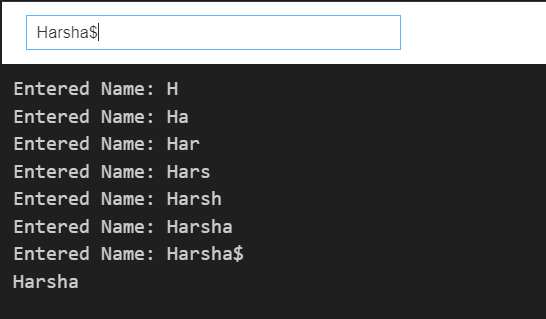
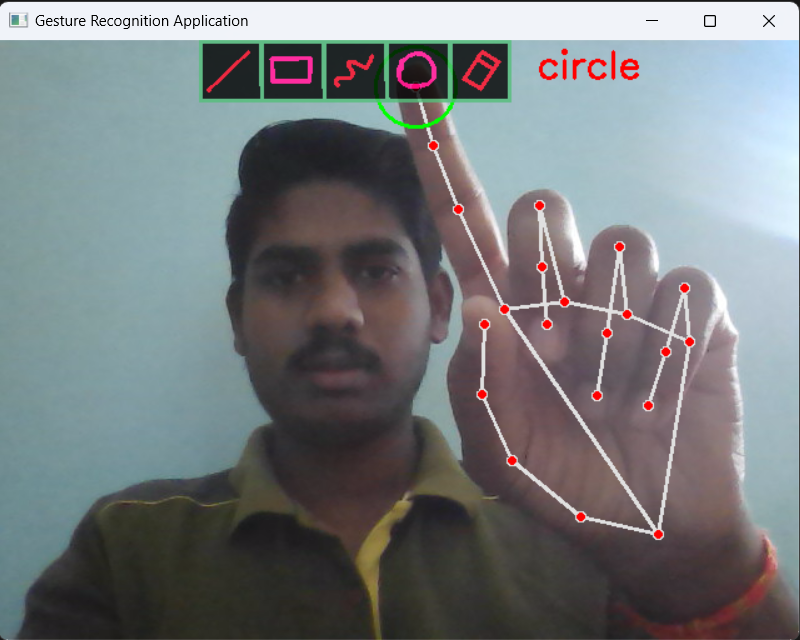
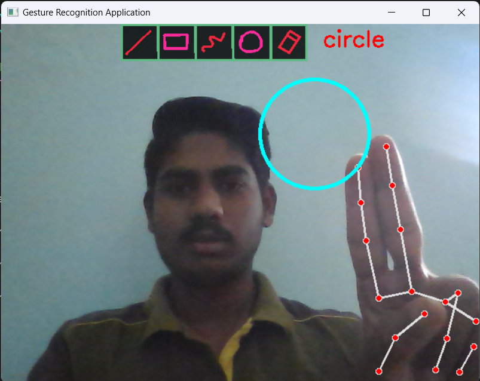
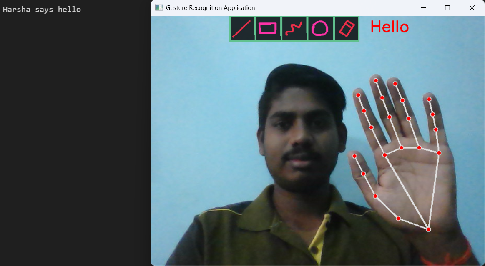
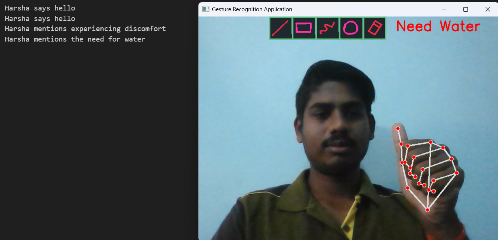
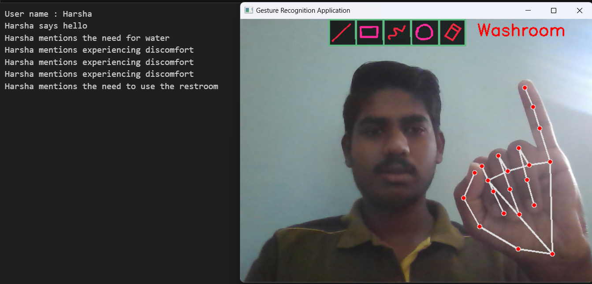
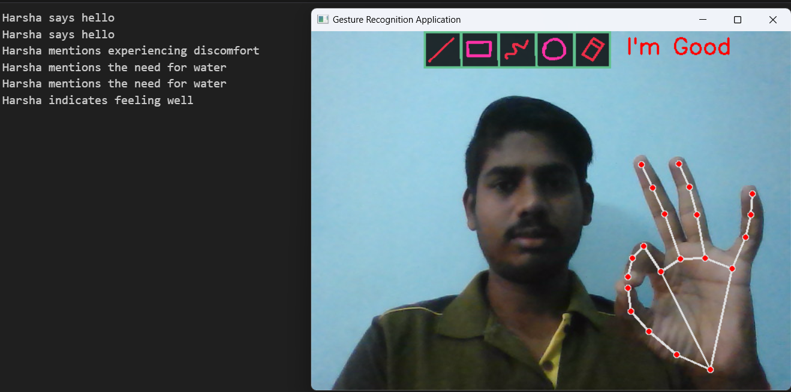
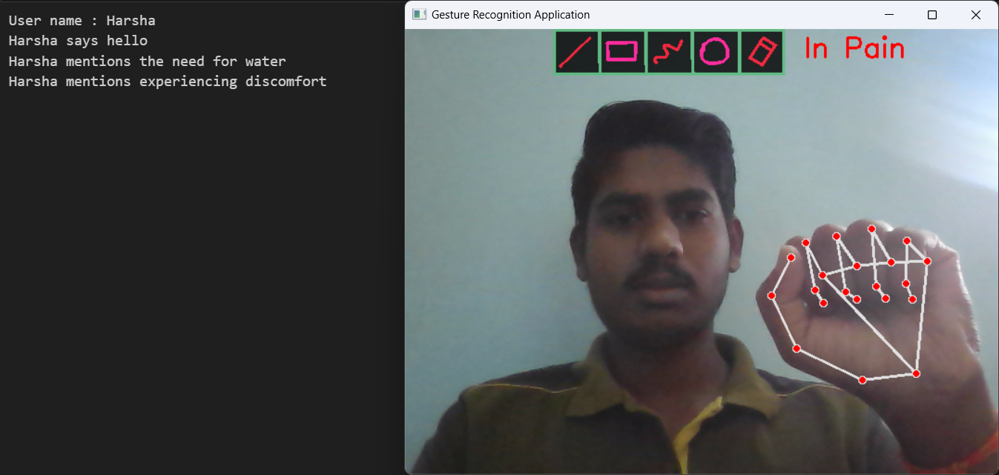

# Aircanvas-gesture_recognition
This project is about drawing on air with hand movements and recognize gestures.

## Install python
Go to the official Python website at [python.org](https://www.python.org/) and install python version 3.


## Libraries to be installed:

1. ### cv2 (OpenCV): 
    - OpenCV (cv2) is a library for computer vision and image processing tasks. It's one of the most widely used libraries for such tasks in Python. You can install it via pip using:
```
        pip install opencv-python
```

2. ### mediapipe: 
    - MediaPipe is a framework developed by Google for building multimodal machine learning pipelines, particularly for processing perceptual data such as images, audio, and video. You can install it via pip using:
```
        pip install mediapipe
```

3. ### numpy: 
    - NumPy is a fundamental package for scientific computing with Python. It provides support for large, multi-dimensional arrays and matrices, along with a collection of mathematical functions to operate on these arrays. You can install it via pip using:
```
        pip install numpy
```

4. ### pyttsx3: 
    - pyttsx3 is a text-to-speech conversion library in Python. It works offline and supports multiple TTS engines. You can install it via pip using:
```
        pip install pyttsx3
```

5. ### ipywidgets and IPython.display: 
    - These packages are part of the IPython ecosystem and are commonly used for creating interactive widgets and displaying multimedia content in Jupyter Notebooks or IPython environments. They are typically installed as part of the Jupyter ecosystem, but you can install them separately via pip using:
```
        pip install ipywidgets
```
## Install packages on one go🚀
- Rather than installing about packages one by one, here is a easy step to do, open command prompt and execute below code snippet 👇
```
        pip install -r import_packages.txt
```

## How to execute code:
- ### How to enter user name
    - Enter user name in widget by executing 1st code cell of `main.ipynb` file
        
    - How to stop taking input in widget
       -  Add special char - '$' at the end of input widget.
- ### Executing Air-Canvas code
    - Change Camera WIDTH and HEIGHT as required
        > **_NOTE:_** Use only camera resolutions values
    - How to add new gesture
        - Add new gesture in `getSign` function based on fingers which are open
            - Return an object of, 
                    1. text - that need to be printed on command prompt and voice out.
                    2. message - that need to be displayed on screen
    - Shapes that can be selected:
        1. Line 
        2. Rectangle
        3. Draw
        4. Circle
        5. Erase
    - How to select a Shape
        Open index finger to move any where, place index finger on any tools that need to be selected for `0.8 sec`
         
    - How to draw a Shape
        Open middle finger along with index finger, draw on the screen
            
    - Gestures that can be recognized:
        Recognized gesture would be displayed on command prompt and sound is triggered
        1. Hello 👋
            
        2. Need Water 🥛
            
        3. Washroom 🚻
            
        4. I'm Good 👍
            
        5. In Pain 🤒
            
    
